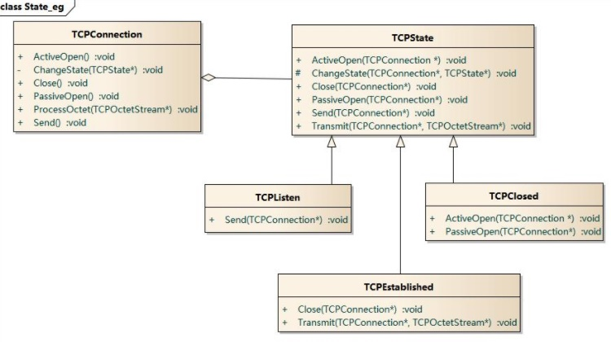

## 设计模式总结（未完待续）
### UML示例

  
*	组合比聚合的关联更加强烈，组合表示产生一个新对象且子对象是必须的（例如四肢，躯干和头组合成人）；聚合表示弱的关联，例如大雁群由大雁聚合而成。

### *参考资料：*  

*	[图说设计模式][9]    
*	[design-patterns-for-humans][2]  
*	[设计模式迷你手册][3]（常见设计模式的UML图）   
*	[Java实例][7]  

### 面向对象的基本概念
*	面向对象（OO，object oriented）的三大法宝：封装（OB，object base）、继承、多态（不同的对象对同一消息作出响应，不同的对象采取不同的行为方式。）
*	面向对象常见的思想
	*	代码的责任分解

### 面向对象设计基本原则【[参考][4]】
*	①单一职责原则（SRP）	
	*	单一职责原则是高内聚低耦合的引申。
	*	不要存在多于一个导致类变更的原因。  
	*	问题由来：类T负责两个不同的职责：职责P1，职责P2。当由于职责P1需求发生改变而需要修改类T时，有可能会导致原本运行正常的职责P2功能发生故障。例如在软件中要实现界面和逻辑的分离。
	
*	②开放-封闭原则（OCP）【[参考][5]】
	> 一个软件实体如类、模块和函数应该对扩展开放，对修改关闭。   
	> 在软件的生命周期内，因为变化、升级和维护等原因需要对软件原有代码进行修改时，可能会给旧代码中引入错误，也可能会使我们不得不对整个功能进行重构，并且需要原有代码经过重新测试。   
	> **等到变化的时候立即采取行动**

*	③里氏替换原则（LSP）
	> 所有引用基类的地方必须能透明地使用其子类的对象。  
	> 里氏替换原则通俗的来讲就是：子类可以扩展父类的功能，但不能改变父类原有的功能。即在类B继承类A时，除添加新的方法完成新增功能外，尽量不要重写父类A的方法，也尽量不要重载父类A的方法。 违反LSP将无法实现OCP。现实生活中企鹅是一种鸟，但在编程过程中鸟不能作为一种抽象，因为企鹅是鸟但企鹅不能飞，如果把鸟作为一种抽象而且fly作为其中的方法，那么企鹅在继承鸟之后必然重写fly，这就违背了LSP。很明显在使用“鸟.fly”的地方，企鹅的行为与其他“鸟”不同，很有可能会出问题。 
	>  
	> 多态的实现可以考虑抽象类
	
*	④依赖倒置原则（DIP）
	> 高层模块不应该依赖低层模块，二者都应该依赖其抽象；抽象不应该依赖细节；细节应该依赖抽象。  
	> 依赖倒置原则基于这样一个事实：相对于细节的多变性，抽象的东西要稳定的多。 依赖倒置原则的核心思想是**面向接口编程**
	
*	⑤接口隔离原则（ISP）
	> 客户端不应该依赖它不需要的接口；一个类对另一个类的依赖应该建立在最小的接口上。
*	迪米特法则（LoD）
	> 一个对象应该对其他对象保持最少的了解,软件编程的总的原则：低耦合，高内聚。例如：两个类之间可以不直接通信（可以没有直接关系），那么这两个类就不应当发生直接的相互作用，如果其中一个类需要调用另一个类的某一个方法，可以通过第三者转发这个调用。    
	> 问题由来：类与类之间的关系越密切，耦合度越大，当一个类发生改变时，对另一个类的影响也越大。   

*	重用发布等价原则（REP）
*	共同封闭原则（CCP）
*	共同重用原则（CRP）
*	无环依赖原则（ADP）
*	稳定依赖原则（SDP）
*	稳定抽象原则（SAP）

## 常见设计模式【[参考][8]】
*	设计模式一般分为3类，创建型、结构型和行为型【[参考][1]】
	*	创建型：Creational patterns are focused towards how to instantiate an object or group of related objects.（如何实例化一个对象或一组相关的对象。）
	*	结构型：Structural patterns are mostly concerned with object composition or in other words how the entities can use each other. Or yet another explanation would be, they help in answering "How to build a software component?"（结构型模式注重对象的结构，换种说法就是对象之间如何交互，或者说如何构建软件的组成元素）
	*	行为型：It is concerned with assignment of responsibilities(algorithms) between the objects. What makes them different from structural patterns is they don't just specify the structure but also outline the patterns for message passing/communication between them. Or in other words, they assist in answering "How to run a behavior in software component?"（关注对象之间责任（算法）的分配，也就是一个对象或软件模块应该具有怎样的行为。）

### 创建型
> Creational patterns are focused towards how to instantiate an object or group of related objects.
#### 简单工厂模式
> Simple factory simply generates an instance for client without exposing any instantiation logic to the client。（创建一个对象但隐藏对象的具体创建方式。）

*	包含角色
	*	Factory：工厂角色
	*	Product：抽象产品角色（抽象产品角色是所创建的所有对象的父类，负责描述所有实例所共有的公共接口）
	*	ConcreteProduct：具体产品角色

*	缺点很明显，无法满足OCP原则（每添加一个新对象都要更改工厂方法）。

		Product* createProduct(string name){//工厂方法
			if ( "A" == proname )
			{
				return new ConcreteProductA();//C++中的多态只能使用指针或引用实现
			}
			else if("B" == proname)
			{
				return new ConcreteProductB();
			}
			return  NULL;
		}

#### 工厂方法模式
*	定义：定义一个用于创建对象的接口，让子类决定实例化哪一个类。Factory Method 使一个类的实例化延迟到其子类。每添加一个新的类型都要继承并定义两个新的类，其中一个为需要添加的类型，另一个为创建这个类型的类。
*	简单工厂模式仅仅对创建的对象进行了抽象，工厂方法模式对简单工厂进行了更深一层的抽象，将工厂方法进行了抽象。
*	包含角色
	*	Product：抽象产品
	*	ConcreteProduct：具体产品
	*	Factory：抽象工厂
	*	ConcreteFactory：具体工厂
*	优缺点：克服了简单工厂无法满足OCP原则的缺陷，但问题是每一个类对应一个工厂类，不便于维护。

		Factory * fc = new ConcreteFactory();
		Product * prod = fc->factoryMethod();

#### 抽象工厂模式
*	定义：提供一个创建一系列相关或相互依赖对象的接口，而无须指定它们具体的类。抽象工厂模式又称为Kit模式，属于对象创建型模式。
*	工厂方法模式只能创建一种类别的对象，而抽象工厂可以同时创建多种不同类别的对象。我感觉抽象工厂是对工厂方法模式的一种封装，是对工厂方法更高一层的抽象。
*	包含角色
	*	Product：抽象产品（族）
	*	ConcreteProduct：具体产品（族）
	*	Factory：抽象工厂
	*	ConcreteFactory：具体工厂

*	以数据库为例，为了简化数据库的操作我们一般对每一个表都创建一个类。为了移植，每个不同的数据库我们都要重写这些类。如果使用工厂方法模式，那么每一个表的创建都要使用一次工厂（每个表有不同的工厂），修改起来依然很麻烦（这里修改的是使用表对象的代码，新对象的创建抽象工厂和工程方法模式的复杂程度是相投的）。使用抽象工厂模式，表的创建只使用一个工厂就好了，修改起来也相对简单。
*	示例代码

		//不同的工厂可以生产不同的产品族
		AbstractFactory * fc = new ConcreteFactory1();
		AbstractProductA * pa =  fc->createProductA();
		AbstractProductB * pb = fc->createProductB();
		pa->use();
		pb->eat();
		
		AbstractFactory * fc2 = new ConcreteFactory2();
		AbstractProductA * pa2 =  fc2->createProductA();
		AbstractProductB * pb2 = fc2->createProductB();
		pa2->use();
		pb2->eat();

#### 建造者模式
*	将一个复杂对象的构建与它的表示分离（把创建过程抽象出来），使得同样的构建过程可以创建不同的表示。   
*	个人体会：在某些应用场景下建造者模式是对工厂模式的一种更高一层的封装。如果在创建一个对象需要多个步骤，每一个步骤又会有种不同的选择（这里不同的选择可以使用工厂实现）。每生产一种新的产品必然有一种新的步骤，为了实现OCP，故将创建过程抽象出来。
*	我们可以看到，建造者模式与工厂模式是极为相似的，总体上，**建造者模式仅仅只比工厂模式多了一个“导演类”的角色**。在建造者模式的类图中，假如把这个导演类看做是最终调用的客户端，那么图中剩余的部分就可以看作是一个简单的工厂模式了。   
*	角色
	*	Builder：抽象建造者
	*	ConcreteBuilder：具体建造者
	*	Director：指挥者
	*	Product：产品角色
*	示例代码

		//建造者只知道“建造”，需要director给出具体的过程
		ConcreteBuilder * builder = new ConcreteBuilder();
		Director  director;
		director.setBuilder(builder);
		Product * pd =  director.construct();
		pd->show();

*	应用说明
	> 举个例子：复杂对象相当于一辆有待建造的汽车，而对象的属性相当于汽车的部件，建造产品的过程就相当于组合部件的过程。很多不同种类的汽车的创建过程相同但组成不同（发动机、轮胎、玻璃等），那么创建者在这里就可以选择不同的子对象并创建。
#### 单例模式
*	定义：保证一个类仅有一个实例，并提供一个访问它的全局访问点（方法）。

#### 原型模式
*	用原型实例指定创建对象的种类，并且通过拷贝这些原型创建新的对象。原型模式主要用于对象的复制。实现一个接口（clone），重写一个方法即完成了原型模式。  
*	以深拷贝和浅拷贝为例来说明：在C++中一般的STL容器的拷贝构造都是深拷贝，然而在Java中，很多对象都是浅拷贝。为了在Java中实现深拷贝，则需要写其他种类的成员方法来实现。这些方法所实现的功能就是以当前对象为原型，创建一个与当前对象完全相同的新对象。如果熟悉opencv，那么Mat中的clone方法就是一种原型模式的实现（为了效率，默认情况下opencv中Mat的拷贝构造是浅拷贝）。

### 结构型
> Structural patterns are mostly concerned with object composition or in other words how the entities can use each other. Or yet another explanation would be, they help in answering "How to build a software component?"

#### 装饰模式
*	动态地给一个对象增加一些额外的职责(Responsibility)，就增加对象功能来说，装饰模式比生成子类实现更为灵活。其别名也可以称为包装器(Wrapper)，与适配器模式的别名相同，但它们适用于不同的场合。根据翻译的不同，装饰模式也有人称之为“油漆工模式”，它是一种对象结构型模式。 
*	*新类中包含旧类(这是聚合的原因)*，从而保存了旧类中的功能新类继承于旧类，从而实现多态。
*	角色
	*	Component: 抽象构件
	*	ConcreteComponent: 具体构件
	*	Decorator: 抽象装饰类
	*	ConcreteDecorator: 具体装饰类
*	示例代码

	    Phone *iphone = new NokiaPhone("6300");  
	    Phone *dpa = new DecoratorPhoneA(iphone); //装饰，增加挂件  
	    Phone *dpb = new DecoratorPhoneB(dpa);    //装饰，屏幕贴膜  
	    dpb->ShowDecorate();  
	> DecoratorPhoneA与NokiaPhone继承于相同的父类FClass，但前者比后者最少多了一个FClass的类的成员。以上面几行代码为例，这个成员用于保存dpa将要装饰的对象iphone，dpa中与iphone对象相同的行为可以直接使用iphone对象中的行为（C++中可以使用useing指令把iphone中的方法直接引入dpa中），需要更改的行为可以在重写时在引入iphone对应的行为并添加额外的行为。

#### 外观模式（facade）
* 　定义：提供一个简易的接口，来访问子系统中的一群接口。外观定义了一个高层接口，让子系统容易使用。
* 　外观模式其实就是对现有模块的封装，使其便于使用。
* 　角色
	*	Facade: 外观角色
	*	SubSystem:子系统角色
*	三种情况：  
	*	系统模块与模块之间的外观  
	*	为子系统创建一个外观模式  
	*	为一个难以维护的大系统创建一个外观模式

#### 适配器模式
*	定义：将一个接口转换成客户希望的另一个接口（外观模式更注重的是封装与简化使用，适配器模式注重的是接口转化与匹配），适配器模式使接口不兼容的那些类可以一起工作，其别名为包装器(Wrapper)。
*	包含角色
	*	Target：目标抽象类
	*	Adapter：适配器类
	*	Adaptee：适配者类
	*	Client：客户类

*	代码示例
	
		Adaptee * adaptee  = new Adaptee();
		Target * tar = new Adapter(adaptee);
		tar->request();

#### 组合模式
*	定义：将对象组合成树形结构以表示“部分-整体”的层次结构。Composite使得用户对单个对象和组合对象的使用具有一致性。
*	包含的角色
	*	component：用于实现所有类共有接口的默认行为；
	*	leaf：组合模式中没有子节点的对象，继承于component；
		*	透明方式：leaf一般不能再添加其他元素，但componet中有add和remove，如果在leaf中重载了这两个方法，则称为透明方式；
		*	安全方式：componet中不声明add和remove方法，在composite中添加这两个方法，这样做的结果是leaf和composite的接口不同，客户端需要做判断；
	*	composite：可以添加子节点（包括其他composite）的对象，继承于component
*	例子：
	>在office word中一个字，一个句子，一个段落可以执行的操作是相同的，而句子、段落都是由字组成的，那么可以认为句子与段落是composite，由字、句子或段落组成，那么对句子的操作就是对每一个字的操作（对composite的操作将递归的发送到composite中的每一个元素）。
*	何时应该使用组合模式：需求中体现了部分与整体层次的结构，或者你希望用户可以忽略组合对象与单个对象的不同，统一地使用组合结构中的所有对象。

#### 代理模式
*	为其他对象提供一种代理以控制对这个对象的访问。
*	代理模式的常见情况
	*	远程代理，为一个对象在不同的地址空间提供局部代表
	*	虚代理，根据需要创建开销很大的对象时，一般HTML中的img使用这种代理，先显示网页，而不是加载完之后显示整个网页
	*	保护代理
	*	智能指引，例如引用计数

#### 桥接模式（Bridge Pattern）
*	定义：将抽象部分与它的实现部分分离，使它们都可以独立地变化。它是一种对象结构型模式，又称为柄体(Handle and Body)模式或接口(Interface)模式。
*	理解桥接模式，重点需要理解如何将抽象化(Abstraction)与实现化(Implementation)脱耦，使得二者可以独立地变化。
*	包含的角色
	*	Abstraction：抽象类
	*	RefinedAbstraction：扩充抽象类
	*	Implementor：实现类接口
	*	ConcreteImplementor：具体实现类
*	示例代码：
	
		//如果pa中的operation使用pImp来画形状，那么提供pa不同的pImp就可以画出不同的线
		//虽然可以使用继承来实现不同颜色的形状，但这样将有m*n个类(m为形状的个数，n为线的类型个数)
		//如果使用桥接模式则只需要m+n个类，便于维护
		Implementor * pImp = new ConcreteImplementorA();
		Abstraction * pa = new RefinedAbstraction(pImp);
		pa->operation();
		
		Abstraction * pb = new RefinedAbstraction(new ConcreteImplementorB());
		pb->operation();

### 行为型
> It is concerned with assignment of responsibilities(algorithms) between the objects. What makes them different from structural patterns is they don't just specify the structure but also outline the patterns for message passing/communication between them. Or in other words, they assist in answering "How to run a behavior in software component?"
#### 策略模式（strategy）
*	Strategy pattern allows you to switch the algorithm or strategy based upon the situation.  
*	策略模式可以和简单工厂模式相结合
*	策略模式可以减少各种算法类与使用算法类之间的耦合

#### 模板方法模式
> 定义一个操作中算法的框架，而将一些步骤延迟到子类中，使得子类可以不改变算法的结构即可重定义该算法中的某些特定步骤。这里的模板就是算法的框架，子类需要实现的是算法框架中的子算法。  
>   模版方法模式由一个抽象类和一个（或一组）实现类通过继承结构组成，抽象类中的方法分为三种：模版方法、抽象方法、钩子方法。[参考][6]

#### 观察者模式
> 定义对象间的一种一对多的依赖关系,当一个对象的状态发生改变时, 所有依赖于它的对象都得到通知并被自动更新。    
> 一般而言要将观察者和通知者都写成抽象类。

#### 状态模式
*	问题：对象如何在每一种状态下表现出不同的行为？如何简化长长的条件判断？   
*	定义：允许一个对象在其内部状态改变时改变它的行为，对象看起来似乎修改了它的类。其别名为状态对象(Objects for States)，状态模式是一种对象行为型模式。  
*	**行为的改变并没有集中在某段程序中而是分散在了各个不同状态行为对象中。**

*	模式的组成 
	*	环境类（Context）:  定义客户感兴趣的接口。维护一个ConcreteState子类的实例，这个实例定义当前状态。
	*	抽象状态类（State）:  定义一个接口以封装与Context的一个特定状态相关的行为。
	*	具体状态类（ConcreteState）:  每一子类实现一个与Context的一个状态相关的行为。

*	代码示例
	
		//具体的行为类
		class Context
		{
		
		public:
			Context();
			virtual ~Context();
		
			void changeState(State * st);//这个方法主要是提供给State对象使用的
			void request();//执行动作（行为）
		
		private:
			State *m_pState;
			//int states;//State对象可以通过这个int变量来更改m_pState所指向的状态
		};

		//状态类中的方法，为了替换Context中的状态，这里需要传入Context对象
        //替换的过程（handle）也可以直接写在行为中
		void ConcreteStateA::handle(Context * c){
			cout << "doing something in State A.\n done,change state to B" << endl;
			c->changeState(ConcreteStateB::Instance());
		}

*	以简化版的TCP为例

#### 备忘录模式（memento）
*	定义：在不破坏封装性的前提下，捕获一个对象的内部状态，并在该对象之外保存这个状态。
*	备忘录模式有三个角色：
	*	originator（发起人）：负责创建一个备忘录（memento）用以记录当前它自身的内部状态。创建者一般有两个方法：
		*	`void set_memento(const memento& m)`，恢复当前对象的某个时间点的状态
		*	`memento create_memento()`，创建当前对象当前时间点的状态
	*	memento（备忘录）：负责保存originator对象的内部状态，并防止originator之外的其他对象访问memento。caretaker只能看见备忘录的窄接口，它只能把memento传递给其他对象。
	*	carataker（管理者）：负责保存memento，不能对memento的内容进行检查。

#### 迭代器模式
*	定义：提供一种方法顺序访问一个聚合对象中各个元素, 而又不需暴露该对象的内部表示。

#### 命令模式（Command Pattern）
*	定义：将一个请求封装为一个对象，从而使我们可用不同的请求对客户进行参数化；对请求排队或者记录请求日志，以及支持可撤销的操作。命令模式是一种对象行为型模式，其别名为动作(Action)模式或事务(Transaction)模式。**命令模式的本质是对命令进行封装，将发出命令的责任和执行命令的责任分割开**。
*	角色（命令执行者、发出者、命令对象三者解耦）：
	*	Command: 抽象命令类
	*	ConcreteCommand: 具体命令类
	*	Invoker: 调用者
	*	Receiver: 接收者
	*	Client:客户类
*	示例代码：

		//创建命令的执行者（接受者）
		Receiver * pReceiver = new Receiver();
		//创建命令对象
		ConcreteCommand * pCommand = new ConcreteCommand(pReceiver);
		//命令的发出者
		Invoker * pInvoker = new Invoker(pCommand);
		pInvoker->call();

*	适用条件
	*	系统需要将请求调用者和请求接收者解耦，使得调用者和接收者不直接交互。
	*	系统需要在不同的时间指定请求、将请求排队和执行请求。
	*	系统需要支持命令的撤销(Undo)操作和恢复(Redo)操作。
	*	系统需要将一组操作组合在一起，即支持宏命令

[1]:http://blog.csdn.net/qq_29994609/article/details/51914046
[2]:https://github.com/kamranahmedse/design-patterns-for-humans#structural-design-patterns
[3]:http://www.icodeguru.com/CPP/MiniDesignPattern/
[4]:http://blog.csdn.net/zhengzhb/article/details/7278174/
[5]:http://blog.csdn.net/zhengzhb/article/details/7296944
[6]:http://blog.csdn.net/zhengzhb/article/details/7405608
[7]:https://github.com/iluwatar/java-design-patterns
[8]:http://blog.csdn.net/hguisu/article/category/1133340
[9]:http://design-patterns.readthedocs.io/zh_CN/latest/