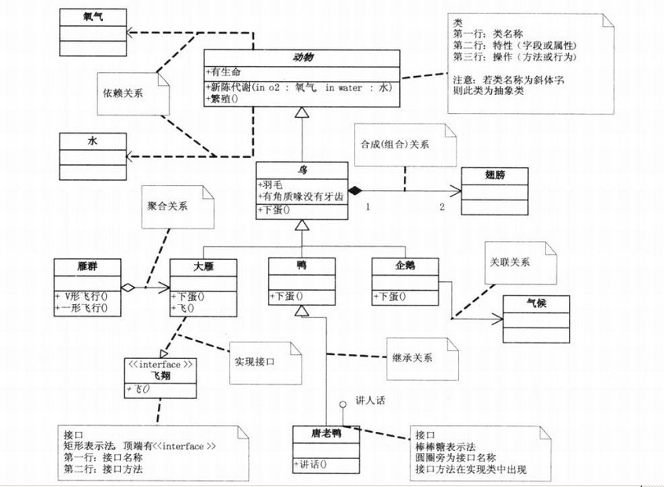

## 读大话设计模式
### UML示例

  
*	组合比聚合的关联更加强烈，组合表示产生一个新对象且子对象是必须的（例如四肢，躯干和头组合成人）；聚合表示若的关联，例如大雁群由大雁聚合而成。
### 面向对象的基本概念
*	面向对象的三大法宝：封装、继承、多态
### 面向对象设计基本原则【[参考][4]】
*	单一职责原则（SRP）	
	> 不要存在多于一个导致类变更的原因。  
	> 问题由来：类T负责两个不同的职责：职责P1，职责P2。当由于职责P1需求发生改变而需要修改类T时，有可能会导致原本运行正常的职责P2功能发生故障。
	
*	开放-封闭原则（OCP）【[参考][5]】
	> 一个软件实体如类、模块和函数应该对扩展开放，对修改关闭。   
	> 在软件的生命周期内，因为变化、升级和维护等原因需要对软件原有代码进行修改时，可能会给旧代码中引入错误，也可能会使我们不得不对整个功能进行重构，并且需要原有代码经过重新测试。   
	> **等到变化的时候立即采取行动**

*	里氏替换原则（LSP）
	> 所有引用基类的地方必须能透明地使用其子类的对象。  
	> 里氏替换原则通俗的来讲就是：子类可以扩展父类的功能，但不能改变父类原有的功能。即在类B继承类A时，除添加新的方法完成新增功能外，尽量不要重写父类A的方法，也尽量不要重载父类A的方法。 违反LSP将无法实现OCP。现实生活中企鹅是一种鸟，但在编程过程中鸟不能作为一种抽象，因为企鹅是鸟但企鹅不能飞，如果把鸟作为一种抽象而且fly作为其中的方法，那么企鹅在继承鸟之后必然重写fly，这就违背了LSP。很明显在使用“鸟.fly”的地方，企鹅的行为与其他“鸟”不同，很有可能会出问题。   
	> 多态的实现可以考虑抽象类
	
*	依赖倒置原则（DIP）
	> 高层模块不应该依赖低层模块，二者都应该依赖其抽象；抽象不应该依赖细节；细节应该依赖抽象。  
	> 依赖倒置原则基于这样一个事实：相对于细节的多变性，抽象的东西要稳定的多。 依赖倒置原则的核心思想是**面向接口编程**
	

*	接口隔离原则（ISP）
*	迪米特法则（）
	> 一个对象应该对其他对象保持最少的了解,软件编程的总的原则：低耦合，高内聚。    
	> 问题由来：类与类之间的关系越密切，耦合度越大，当一个类发生改变时，对另一个类的影响也越大。   

*	重用发布等价原则（REP）
*	共同封闭原则（CCP）
*	共同重用原则（CRP）
*	无环依赖原则（ADP）
*	稳定依赖原则（SDP）
*	稳定抽象原则（SAP）

## 常见设计模式【[参考][8]】
设计模式一般分为3类，创建型、结构型和行为型【[参考][1]】

*参考资料：*  
[design-patterns-for-humans][2]  
[设计模式迷你手册][3]   
[Java实例][7]  

### 创建型
> Creational patterns are focused towards how to instantiate an object or group of related objects.
#### 简单工厂模式
> Simple factory simply generates an instance for client without exposing any instantiation logic to the client

#### 工厂方法模式
> 工厂模式根据抽象程度的不同分为三种：简单工厂模式（也叫静态工厂模式）、本文所讲述的工厂方法模式、以及抽象工厂模式。

#### 抽象工厂模式
> 与工厂方法模式的区别就在于，工厂方法模式针对的是一个产品等级结构；而抽象工厂模式则是针对的多个产品等级结构。    

*	三个工厂的区别
	*	简单工厂 ： 用来生产同一等级结构中的任意产品。（对于增加新的产品，无法满足开闭原则）
	*	工厂方法 ：用来生产同一等级结构中的固定产品。（支持增加任意产品）   
	*	抽象工厂 ：用来生产不同产品族的全部产品。（对于增加新的产品，无能为力；支持增加产品族）以数据库为例，抽象工厂将抽象整个数据库，这个工厂可以生产任意多的不同表的对象，而工厂方法模式只能生产同一种表的任意多对象。    

#### 建造者模式
> 将一个复杂对象的构建与它的表示分离，使得同样的构建过程可以创建不同的表示。   
> 我们可以看到，建造者模式与工厂模式是极为相似的，总体上，建造者模式仅仅只比工厂模式多了一个“导演类”的角色。在建造者模式的类图中，假如把这个导演类看做是最终调用的客户端，那么图中剩余的部分就可以看作是一个简单的工厂模式了。   
> 一般来说，如果产品的建造很复杂，那么请用工厂模式；如果产品的建造更复杂，那么请用建造者模式。

#### 原型模式
> 用原型实例指定创建对象的种类，并通过拷贝这些原型创建新的对象。原型模式主要用于对象的复制。  
> 实现一个接口（clone），重写一个方法即完成了原型模式。  
### 结构型
> Structural patterns are mostly concerned with object composition or in other words how the entities can use each other. Or yet another explanation would be, they help in answering "How to build a software component?"

#### 装饰模式
> 动态的给一个对象添加一些额外的职责，就增加功能而言，装饰模式比生成子类更为灵活。   
> 一般而言装饰模式不添加新的方法，只重载现有的方法并添加一些功能。   
> 新类中包含旧类，从而保存了旧类中的功能新类继承于旧类，从而实现多态。

#### 外观模式（facade）
> 为子系统中的一组接口提供一个一致的界面，Facade模式定义了一个高层接口，这个接口使得这一子系统更加容易使用。使用外观模式的三种情况：  
> 系统模块与模块之间的外观  
> 为子系统创建一个外观模式  
> 为一个难以维护的大系统创建一个外观模式

#### 代理模式
*	为其他对象提供一种代理以控制对这个对象的访问。
*	代理模式的常见情况
	*	远程代理，为一个对象在不同的地址空间提供局部代表
	*	虚代理，根据需要创建开销很大的对象时，一般HTML中的img使用这种代理，先显示网页，而不是加载完之后显示整个网页
	*	保护代理
	*	智能指引，例如引用计数

### 行为型
> It is concerned with assignment of responsibilities(algorithms) between the objects. What makes them different from structural patterns is they don't just specify the structure but also outline the patterns for message passing/communication between them. Or in other words, they assist in answering "How to run a behavior in software component?"
#### 策略模式（strategy）
> Strategy pattern allows you to switch the algorithm or strategy based upon the situation.  
*	策略模式可以和简单工厂模式相结合
*	策略模式可以减少各种算法类与使用算法类之间的耦合

#### 模板方法模式
> 定义一个操作中算法的框架，而将一些步骤延迟到子类中，使得子类可以不改变算法的结构即可重定义该算法中的某些特定步骤。这里的模板就是算法的框架，子类需要实现的是算法框架中的子算法。  
>   模版方法模式由一个抽象类和一个（或一组）实现类通过继承结构组成，抽象类中的方法分为三种：模版方法、抽象方法、钩子方法。[参考][6]

#### 观察者模式
> 定义对象间的一种一对多的依赖关系,当一个对象的状态发生改变时, 所有依赖于它的对象都得到通知并被自动更新。    
> 一般而言要将观察者和通知者都写成抽象类。

#### 状态模式
> 问题：对象如何在每一种状态下表现出不同的行为？   
> 在很多情况下，一个对象的行为取决于一个或多个动态变化的属性，这样的属性叫做状态，这样的对象叫做有状态的(stateful)对象，这样的对象状态是从事先定义好的一系列值中取出的。当一个这样的对象与外部事件产生互动时，其内部状态就会改变，从而使得系统的行为也随之发生变化。  
> 状态模式的好处是将特定状态相关的行为局部化，并且将不同状态的行为分割开。  

*	模式的组成 
	*	环境类（Context）:  定义客户感兴趣的接口。维护一个ConcreteState子类的实例，这个实例定义当前状态。
	*	抽象状态类（State）:  定义一个接口以封装与Context的一个特定状态相关的行为。
	*	具体状态类（ConcreteState）:  每一子类实现一个与Context的一个状态相关的行为。
  

[1]:http://blog.csdn.net/qq_29994609/article/details/51914046
[2]:https://github.com/kamranahmedse/design-patterns-for-humans#structural-design-patterns
[3]:http://www.icodeguru.com/CPP/MiniDesignPattern/
[4]:http://blog.csdn.net/zhengzhb/article/details/7278174/
[5]:http://blog.csdn.net/zhengzhb/article/details/7296944
[6]:http://blog.csdn.net/zhengzhb/article/details/7405608
[7]:https://github.com/iluwatar/java-design-patterns
[8]:http://blog.csdn.net/hguisu/article/category/1133340